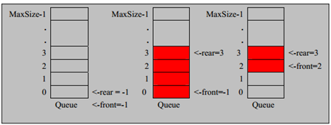
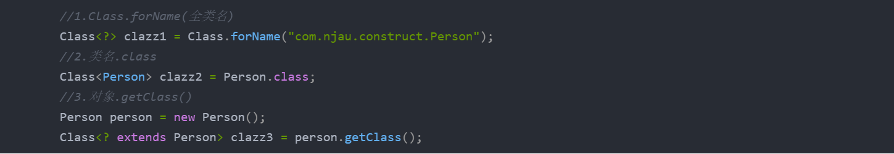
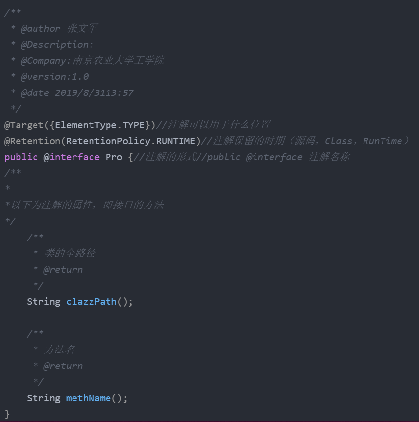
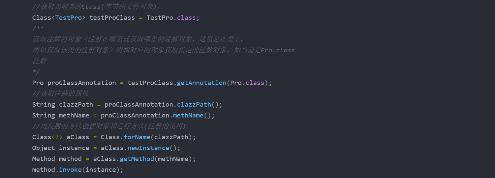

# data_structure

# 数据结构和算法

## 线性数据结构
### 数组
### 稀疏数组
### 队列 ->简单数组队列
### 队列 ->数组循环队列
### 自定义队列
### 栈
### 递归

@[toc]

## 数组队列

### 简述：
 *队列本身是有序列表，若使用数组的结构来存储队列的数据，则队列数组的声明如下图, 其中 maxSize 是该队列的最大容量。
因为队列的输出、输入是分别从前后端来处理，因此需要两个变量 front及 rear分别记录队列前后端的下标，front 会随着数据输出而改变，而 rear则是随着数据输入而改变，如图所示:*

1. 自定义简单数组对列（有问题，不能重复使用）

## 数组环形队列
*上面简介和用数组简单实现了一下队列，但这种队列依然存在问题，问题就是用数组简单实现的队列会存在假溢出现象（即：在数据退出队列时，虽然数据未满，但是队列的 rear 已经是数组的大小，即显示已满。故不能继续插入数据 ），这样会极大的降低了数组的利用，所以，在这里我将会用数组实现一个环形队列，以解决这种问题。*

 - 首先在这里，声明了一个容量大小为8的数组，并标出了索引0-7，然后使用front和 rear 分别来表示队列的，队首和队尾；在下图中，front 和 rear 的位置一开始都指向是了索引0的位置，这意味着当front == rear 的时候 队列为空 ，务必牢记这一点，以便区分后面介绍队列快满时的临界条件

 - front：表示队列队首，始终指向队列中的第一个元素（当队列空时，front指向索引为0的位置）
   
   
  - rear ：表示队列队尾，始终指向队列中的最后一个元素的下一个位置
   
   
  - 元素入队，维护rear 的位置，进行rear ++操作
   
   
  -  元素出队，维护front的位置，进行front++操作

按照上面的front和rear的意思，对队列的维护即对是简单的++操作，即：入队就是将rear++，front不变，出队就是front++，rear不变。
即如下图所示：

然而，如果再向后面添加，即当出现

**即当rear指向数组的最后，而且队列也已经有元素出队时，应为rear不能再向后移动，所以虽然数组有空的空间，
但却不能插入数据，此时就出现了数组假溢出现象。然而，如果rear的位置用（rear+1)% maxSize ，则就会避免出现这种情况，
即我们将现在的数组看成是一个环，当rear=front=0时，数组为空，插入一条数据，rear = （rear+1 ）%maxSize = 1%8= 1； 
当队列上图情况时，即rear已经是移动到数组的最后一个位置，而且有数据已经出队时，这时插入数据时，rear = （rear+1 ）% maxSize = （7+1）%8 = 0，
即循环到了下一个位置。同理，front的位置决定也是：front= (front+1)%maxSize，在这种情况下，必须要牺牲一个数组空间来（用于方便判断），
而且判断队列是否已满的条件是rear==(front+1)%maxSize，为空rear==front ==0；**

### 链表 ->链表实现、简单操作，反转，反向输出（利用堆栈）

# 反射和注解

@[TOC]
## 反射
获取字节码的三种方法：

     获取class对象的三种方法
     1.Class.forName(全类名)
     2.类名.class
     3.对象.getClass()
   如：
 

  **(其他操作可看JDK文档的Class类进行)**

## 注解

## 解析注解

